# 🔐 Serverless Authentication System with AWS Cognito

[](https://aws.amazon.com)
[](https://terraform.io)
[](https://reactjs.org)
[](https://python.org)

A production-ready serverless authentication system built on AWS, featuring **100% httpOnly cookie security**, comprehensive rate limiting, and Google OAuth integration.

## 🌟 Key Features

### Implemented Authentication Features
✅ **User Registration** with email verification  
✅ **Secure Sign-in** with httpOnly cookies  
✅ **Google OAuth 2.0** integration  
✅ **Password Reset** flow with email codes  
✅ **Token Refresh** mechanism  
✅ **Session Management** with inactivity detection  
✅ **Email Verification** with resend capability  
✅ **User Logout** with cookie clearing  

### Security Implementation
🔒 **HttpOnly Cookies** - Tokens never exposed to JavaScript  
🛡️ **CSRF Protection** - SameSite=Strict cookies  
🚦 **Rate Limiting** - Per-endpoint throttling  
🔑 **Secure Passwords** - Cryptographically random for OAuth users  
📊 **Security Monitoring** - CloudWatch dashboards & alarms  
🔐 **Token Security** - Access (1hr), Refresh (30 days)  

## 🏗️ Infrastructure Architecture

```mermaid
graph TB
    subgraph "User Layer"
        U[👤 User Browser]
    end
    
    subgraph "CDN & Frontend"
        CF[☁️ CloudFront CDN<br/>Global Edge Locations]
        S3[📦 S3 Bucket<br/>Static Website Hosting]
        CF --> S3
    end
    
    subgraph "API Layer"
        AG[🚪 API Gateway<br/>REST API + Rate Limiting]
        R53[🌐 Route53<br/>DNS Management]
        ACM[🔒 ACM Certificate<br/>SSL/TLS]
        R53 --> AG
        ACM --> AG
    end
    
    subgraph "Compute Layer"
        L1[⚡ signup<br/>Python 3.12]
        L2[⚡ signin<br/>Python 3.12]
        L3[⚡ google_auth<br/>Python 3.12]
        L4[⚡ verify<br/>Python 3.12]
        L5[⚡ user_info<br/>Python 3.12]
        L6[⚡ refresh<br/>Python 3.12]
        L7[⚡ logout<br/>Python 3.12]
        L8[⚡ forgot_password<br/>Python 3.12]
        L9[⚡ reset_password<br/>Python 3.12]
        L10[⚡ verify_token<br/>Python 3.12]
        L11[⚡ resend_verification<br/>Python 3.12]
        L12[⚡ custom_message<br/>Python 3.12]
        LL[📚 Lambda Layer<br/>Shared Utils]
        
        AG --> L1
        AG --> L2
        AG --> L3
        AG --> L4
        AG --> L5
        AG --> L6
        AG --> L7
        AG --> L8
        AG --> L9
        AG --> L10
        AG --> L11
        AG --> L12
        
        L1 -.-> LL
        L2 -.-> LL
        L3 -.-> LL
        L4 -.-> LL
        L5 -.-> LL
        L6 -.-> LL
        L7 -.-> LL
        L8 -.-> LL
        L9 -.-> LL
        L10 -.-> LL
        L11 -.-> LL
        L12 -.-> LL
    end
    
    subgraph "Authentication & Database"
        COG[🔐 AWS Cognito<br/>User Pool + Identity Provider]
        DDB[🗄️ DynamoDB<br/>User Records Table]
        GOOGLE[🔍 Google OAuth<br/>Identity Provider]
        
        L1 --> COG
        L2 --> COG
        L3 --> COG
        L3 --> GOOGLE
        L4 --> COG
        L5 --> COG
        L5 --> DDB
        L6 --> COG
        L8 --> COG
        L9 --> COG
        L10 --> COG
        L11 --> COG
        L12 --> COG
    end
    
    subgraph "Monitoring & Alerts"
        CW[📊 CloudWatch<br/>3 Dashboards]
        CWL[📝 CloudWatch Logs<br/>Function Logs]
        SNS[📧 SNS Topics<br/>Email Alerts]
        CWA[⚠️ CloudWatch Alarms<br/>Security & System]
        
        L1 --> CWL
        L2 --> CWL
        L3 --> CWL
        L4 --> CWL
        L5 --> CWL
        L6 --> CWL
        L7 --> CWL
        L8 --> CWL
        L9 --> CWL
        L10 --> CWL
        L11 --> CWL
        L12 --> CWL
        
        CWL --> CW
        CWA --> SNS
        AG --> CWA
    end
    
    subgraph "Security Layer"
        IAM[🔐 IAM Roles<br/>Least Privilege]
        WAF[🛡️ Rate Limiting<br/>Per-Endpoint Throttling]
        
        IAM -.-> L1
        IAM -.-> L2
        IAM -.-> L3
        IAM -.-> L4
        IAM -.-> L5
        IAM -.-> L6
        IAM -.-> L7
        IAM -.-> L8
        IAM -.-> L9
        IAM -.-> L10
        IAM -.-> L11
        IAM -.-> L12
        
        WAF --> AG
    end
    
    %% User Flow
    U -->|HTTPS| CF
    U -->|HttpOnly Cookies<br/>SameSite=Strict| AG
    
    %% Styling
    classDef frontend fill:#e1f5fe
    classDef api fill:#f3e5f5
    classDef compute fill:#fff3e0
    classDef database fill:#e8f5e8
    classDef monitoring fill:#fff8e1
    classDef security fill:#ffebee
    
    class U,CF,S3 frontend
    class AG,R53,ACM api
    class L1,L2,L3,L4,L5,L6,L7,L8,L9,L10,L11,L12,LL compute
    class COG,DDB,GOOGLE database
    class CW,CWL,SNS,CWA monitoring
    class IAM,WAF security
```



### Domain Configuration
- **Frontend**: `https://filodelight.online` (CloudFront → S3)
- **API**: `https://api.filodelight.online` (Route53 → API Gateway)
- **Region**: `ap-southeast-2` (Sydney)
- **SSL**: AWS Certificate Manager (ACM)

## 🚀 Quick Start

### Prerequisites
- AWS Account with programmatic access
- Terraform >= 1.5
- Node.js >= 18
- Python >= 3.12 (for local Lambda development)
- Google Cloud Console project
- Domain registered in Route53 (or external DNS provider)

### 1. Clone Repository
```bash
git clone https://github.com/CaringalML/Serverless-Auth-with-AWS-Cognito.git
cd Serverless-Auth-with-AWS-Cognito
```

### 2. Set Up Google OAuth (Required for Google Sign-In)

#### Google Cloud Console Configuration

1. **Go to Google Cloud Console**:
   - Navigate to [Google Cloud Console](https://console.cloud.google.com)
   - Create a new project or select existing one

2. **Enable APIs**:
   ```bash
   # Enable required APIs
   gcloud services enable gmail.googleapis.com
   gcloud services enable oauth2.googleapis.com
   ```
   Or via Console: APIs & Services → Library → Search "Google+ API" → Enable

3. **Configure OAuth Consent Screen**:
   - Go to: APIs & Services → OAuth consent screen
   - Choose "External" user type
   - Fill required fields:
     - **App name**: Your App Name
     - **User support email**: Your email
     - **Developer contact**: Your email
   - Add scopes:
     - `../auth/userinfo.email`
     - `../auth/userinfo.profile`
     - `openid`

4. **Create OAuth 2.0 Client ID**:
   - Go to: APIs & Services → Credentials
   - Click "Create Credentials" → "OAuth 2.0 Client ID"
   - Application type: "Web application"
   - Name: "Serverless Auth Web Client"
   - **Authorized JavaScript origins**:
     ```
     https://filodelight.online
     https://api.filodelight.online
     ```
   - **Authorized redirect URIs**:
     ```
     https://api.filodelight.online/auth/google/callback
     https://filodelight.online/auth/callback
     ```
   - Click "Create"
   - **Save the Client ID and Client Secret** (you'll need these)

5. **Add Test Users (Development)**:
   - OAuth consent screen → Test users
   - Add your email addresses for testing

#### Configure Terraform Variables
```bash
cp terraform.tfvars.example terraform.tfvars
# Edit terraform.tfvars with:
```

**terraform.tfvars:**
```hcl
# Google OAuth Credentials (from step 4 above)
google_client_id     = "123456789012-abcdefghijklmnopqrstuvwxyz123456.apps.googleusercontent.com"
google_client_secret = "GOCSPX-aBcDeFgHiJkLmNoPqRsTuVwXyZ"

# Alert Email Addresses
security_alert_email = "your-email@example.com"
system_alert_email   = "your-email@example.com"
```

### 3. Deploy Infrastructure
```bash
terraform init
terraform plan
terraform apply
```

### 4. Deploy Frontend
```bash
cd frontend-auth
npm install
npm run build

# Upload to S3 (replace with your bucket)
aws s3 sync build/ s3://serverless-auth-cognito-frontend-2025/react-build --delete

# Invalidate CloudFront
aws cloudfront create-invalidation --distribution-id YOUR_DIST_ID --paths "/*"
```

## 📦 Lambda Functions

| Function | Purpose | Trigger |
|----------|---------|---------|
| `signup` | User registration | POST /auth/signup |
| `signin` | User login | POST /auth/signin |
| `google_auth` | Google OAuth flow | GET /auth/google, /auth/google/callback |
| `verify` | Email verification | POST /auth/verify |
| `forgot_password` | Initiate password reset | POST /auth/forgot-password |
| `reset_password` | Complete password reset | POST /auth/reset-password |
| `refresh` | Refresh access token | POST /auth/refresh |
| `logout` | Clear auth cookies | POST /auth/logout |
| `user_info` | Get user profile | GET /auth/user-info |
| `verify_token` | Validate token | GET /auth/verify-token |
| `resend_verification` | Resend verification email | POST /auth/resend-verification |
| `custom_message` | Customize Cognito emails | Cognito trigger |

## 🔒 Security Features

### Rate Limiting (Implemented)
| Endpoint | Rate | Burst | Purpose |
|----------|------|-------|---------|
| /auth/signin | 5/sec | 10 | Prevent brute force |
| /auth/signup | 2/sec | 5 | Prevent bot registration |
| /auth/forgot-password | 1/sec | 3 | Prevent email bombing |
| /auth/verify | 3/sec | 6 | Prevent code guessing |
| /auth/refresh | 10/sec | 20 | Token refresh |
| /auth/google/* | 10/sec | 20 | OAuth flow |

### Cookie Configuration
```javascript
HttpOnly: true     // XSS Protection
Secure: true       // HTTPS Only
SameSite: Strict   // CSRF Protection
Domain: .filodelight.online  // Shared across subdomains
```

## 📊 Monitoring & Alerting

### CloudWatch Dashboards (3)
1. **Security Overview** - Failed logins, suspicious activity
2. **User Activity** - Signups, active users, page views
3. **System Health** - Lambda performance, API errors

### SNS Alerts Configured
- **High Failed Logins** - 10+ failures in 5 minutes
- **API Errors** - 100+ errors in 5 minutes
- **Lambda Errors** - Function failures
- **Token Refresh Failures** - Authentication issues
- **Throttling Alerts** - Rate limit violations

### Key Metrics Tracked
- Failed login attempts by IP
- Daily active users
- New signups
- API response times
- Lambda cold starts
- Token refresh success rate

## 💻 Frontend Stack

### Technologies
- **React 19.1** - Latest React version
- **Redux Toolkit** - State management
- **React Router v7** - Navigation
- **Axios** - HTTP client with interceptors
- **Tailwind CSS** - Styling

### Components
- `SignIn.jsx` - Login with Google OAuth
- `SignUp.jsx` - Registration form
- `Verify.jsx` - Email verification
- `Dashboard.jsx` - Protected user area
- `ForgotPassword.jsx` - Password reset initiation
- `ResetPassword.jsx` - Password reset completion
- `ProtectedRoute.jsx` - Auth guard
- `InactivityWarning.jsx` - Session timeout

## 🚢 CI/CD Pipeline

### GitHub Actions Workflow
- **Trigger**: Push to `google-OAuth` branch
- **Terraform Validation**: Format & syntax check
- **React Build**: Node.js 20.x
- **S3 Deployment**: Automatic upload
- **CloudFront Invalidation**: Cache clearing

### Required GitHub Secrets
- `AWS_ACCESS_KEY_ID`
- `AWS_SECRET_ACCESS_KEY`
- `REACT_APP_API_URL`
- `CLOUDFRONT_DISTRIBUTION_ID`

## 💰 Actual Infrastructure Costs

### Current AWS Services Used
| Service | Monthly Cost (Estimate) |
|---------|------------------------|
| Cognito | $0 (50K MAU free tier) |
| Lambda | ~$2 (with free tier) |
| API Gateway | ~$3.50 |
| DynamoDB | ~$0.25 |
| CloudWatch | ~$10 (3 dashboards) |
| CloudFront | ~$1 |
| Route53 | $0.50 |
| S3 | ~$0.10 |
| SNS | ~$0.10 |
| **Total** | **~$17.45/month** |

## 📁 Project Structure

```
.
├── lambda_functions/         # 14 Lambda functions
│   ├── signin/
│   ├── signup/
│   ├── google_auth/
│   ├── verify/
│   ├── forgot_password/
│   ├── reset_password/
│   ├── refresh/
│   ├── logout/
│   ├── user_info/
│   ├── verify_token/
│   ├── resend_verification/
│   ├── custom_message/
│   └── shared/              # Utils layer
├── frontend-auth/           # React application
│   ├── src/
│   │   ├── components/     # 8 components
│   │   ├── services/       # Auth service
│   │   ├── store/          # Redux store
│   │   ├── contexts/       # Auth context
│   │   └── utils/          # Validation
│   └── package.json
├── .github/workflows/       # CI/CD pipeline
├── *.tf files              # 14 Terraform configs
└── terraform.tfvars.example
```

## 🔧 Configuration Files

### Terraform Resources (14 files)
- `api_gateway.tf` - REST API with rate limiting
- `cognito.tf` - User pool & Google identity provider
- `dynamodb.tf` - User records table
- `lambda.tf` - Function definitions
- `cloudfront.tf` - CDN configuration
- `s3.tf` - Static website hosting
- `route53.tf` - DNS configuration
- `cloudwatch.tf` - Logs configuration
- `cloudwatch_dashboards.tf` - 3 dashboards
- `sns_alerts.tf` - Email notifications
- `iam.tf` - Roles and policies
- `variables.tf` - Configuration variables
- `outputs.tf` - Deployment outputs
- `provider.tf` - AWS provider

## 🚨 Production Checklist

- [x] Custom domain configured (filodelight.online)
- [x] SSL certificates active
- [x] Google OAuth configured
- [x] Rate limiting enabled
- [x] CloudWatch dashboards created
- [x] SNS email alerts configured
- [x] httpOnly cookies implemented
- [x] CORS configured
- [ ] DynamoDB backup strategy
- [ ] Disaster recovery plan
- [ ] Load testing completed
- [ ] Security audit performed

## 🛠️ Common Operations

### View Logs
```bash
aws logs tail /aws/lambda/serverless-auth-dev-signin --follow
```

### Check Metrics
```bash
aws cloudwatch get-metric-statistics \
  --namespace AWS/Lambda \
  --metric-name Invocations \
  --dimensions Name=FunctionName,Value=serverless-auth-dev-signin \
  --start-time 2025-09-03T00:00:00Z \
  --end-time 2025-09-04T00:00:00Z \
  --period 3600 \
  --statistics Sum
```

### Update Lambda Function
```bash
cd lambda_functions/signin
zip -r ../signin.zip .
aws lambda update-function-code \
  --function-name serverless-auth-dev-signin \
  --zip-file fileb://../signin.zip
```

## 🐛 Troubleshooting

### Common Issues

**Cookie not being set**
- Ensure domains share same root domain
- Check SameSite and Secure flags
- Verify CORS configuration

**Google OAuth redirect error**
- Update redirect URIs in Google Console:
  - `https://api.filodelight.online/auth/google/callback`
  - `https://filodelight.online/auth/callback`
- Check environment variables in Lambda (GOOGLE_CLIENT_ID, GOOGLE_CLIENT_SECRET)
- Verify API Gateway routes are deployed
- Ensure OAuth consent screen is published (not in draft)
- Add test users if app is in testing mode

**Rate limiting too strict**
- Adjust limits in `api_gateway.tf`
- Monitor CloudWatch metrics
- Consider user patterns

**Lambda cold starts**
- Enable provisioned concurrency
- Optimize package size
- Use Lambda layers for dependencies

## 📝 License

MIT License - See [LICENSE](LICENSE) file

## 👨‍💻 Author

**Martin Lawrence Caringal**  
Email: lawrencecaringal5@gmail.com  
GitHub: [@CaringalML](https://github.com/CaringalML)

## 🙏 Acknowledgments

- AWS for serverless infrastructure
- Claude AI for development assistance
- Open source community

---

*Last Updated: September 2025*  
*Version: 1.0.0*