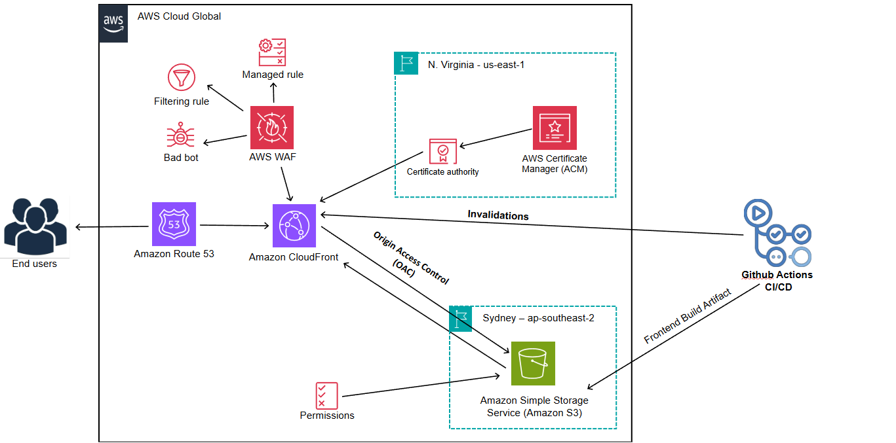

# Frontend Infrastructure

[](https://github.com/CaringalML/CloudStruct-A-Frontend-Infrastructure-with-AWS-CloudFront-and-S3/actions/workflows/frontend-cicd.yml)

This Terraform configuration deploys the frontend infrastructure for a React-based web application. The setup includes CloudFront CDN, S3 storage for React build artifacts, and security configurations.

## 🏛️ Architecture Overview



This project implements a modern, **serverless** frontend infrastructure pattern leveraging AWS services. The website is hosted as static files in an S3 bucket and distributed globally through CloudFront's CDN network, with WAF security and proper domain configuration.

### ☁️ Serverless Benefits

This architecture is fully serverless, providing several advantages:
- No server management or maintenance required
- Automatic scaling to handle any level of traffic
- Pay-per-use pricing model (you only pay for what you use)
- High availability and fault tolerance built-in
- Reduced operational complexity and overhead

The infrastructure consists of the following components:

- 📦 **S3 Bucket**: Stores the compiled frontend assets
- 🌐 **CloudFront Distribution**: Serves the website with low latency globally
- 🔄 **Route53**: Manages DNS records for the domain
- 🔒 **ACM Certificate**: Provides SSL/TLS for secure HTTPS connections
- 🛡️ **WAF (Web Application Firewall)**: Protects the application from common web exploits
- ⚡ **CloudFront Function**: Handles SPA routing for React application

## 📋 Prerequisites

- ☁️ AWS Account with appropriate permissions
- 🏗️ Terraform v1.0.0 or newer
- 🔧 AWS CLI configured with appropriate credentials
- 🌐 A registered domain name managed by Route53
- 📂 GitHub repository with the frontend codebase

### 🏁 Initial Setup Steps

1. **Domain Registration**:
   - Register your domain through AWS Route53 or transfer an existing domain
   - Ensure that you have a Route53 hosted zone created for your domain

2. **AWS CLI Configuration**:
   ```bash
   aws configure
   ```
   - Enter your AWS Access Key ID and Secret Access Key
   - Specify the default region (should match `var.aws_region` in variables.tf)

3. **GitHub Repository Setup**:
   - Create a GitHub repository for your frontend code
   - Set up required secrets in GitHub repository settings (see GitHub Actions Secrets section)
   - Push your frontend code to the repository

4. **Required IAM Permissions**:
   The AWS credentials used need permissions for:
   - S3 (CreateBucket, PutObject, ListBucket, etc.)
   - CloudFront (CreateDistribution, CreateInvalidation, etc.)
   - Route53 (ChangeResourceRecordSets, etc.)
   - ACM (RequestCertificate, etc.)
   - WAF (CreateWebACL, etc.)

## ⚙️ Configuration

### 🔑 Required Variables

Key variables that need to be set:

| Variable | Description | Default |
|----------|-------------|---------|
| `domain_name` | Root domain name | artisantiling.co.nz |
| `s3_bucket_name` | Name of the S3 bucket | caringalfrontend |
| `aws_region` | AWS region | ap-southeast-2 |
| `environment` | Environment name | production |

### 🔒 GitHub Actions Secrets

The following secrets need to be set in your GitHub repository settings for the CI/CD workflow:

- `AWS_ACCESS_KEY_ID`: AWS access key with permissions for S3 and CloudFront
- `AWS_SECRET_ACCESS_KEY`: AWS secret key
- `AWS_REGION`: AWS region for deployment (should match `var.aws_region` in variables.tf)
- `CLOUDFRONT_DISTRIBUTION_ID`: ID of your CloudFront distribution (available as an output after initial terraform deployment)
- `VITE_API_BASE_URL`: Base URL for the backend API

These secrets are used by the GitHub Actions workflow defined in `.github/workflows/node.js.yml`.

## 🔧 Local Development

### Environment Configuration

The project uses environment variables for configuration. For local development, create a `.env` file in the root directory:

```
# API Configuration - Using the local API
VITE_API_BASE_URL=http://localhost/api
```

This configuration will be overridden in the deployment process with the production values set in GitHub Secrets.

### .gitignore

The project includes a standard `.gitignore` file to prevent committing unnecessary files:

```
# Logs
logs
*.log
npm-debug.log*
yarn-debug.log*
yarn-error.log*
pnpm-debug.log*
lerna-debug.log*

# Dependencies
node_modules

# Environment variables
.env

# Build output
dist
dist-ssr
*.local

# Editor directories and files
.vscode/*
!.vscode/extensions.json
.idea
.DS_Store
*.suo
*.ntvs*
*.njsproj
*.sln
*.sw?
```

Note that the `.env` file is excluded from Git to prevent accidentally committing sensitive information. The CI/CD workflow will create the appropriate environment variables during deployment.

## 🚀 Deployment

### 🛠️ Manual Deployment
   ```
   git clone https://github.com/CaringalML/CloudStruct-A-Frontend-Infrastructure-with-AWS-CloudFront-and-S3.git
   cd CloudStruct-A-Frontend-Infrastructure-with-AWS-CloudFront-and-S3
   ```
2. Initialize Terraform:
   ```
   terraform init
   ```
3. Plan the deployment:
   ```
   terraform plan
   ```
4. Apply the configuration:
   ```
   terraform apply
   ```

### 🧹 Destroying Infrastructure

To remove all the AWS resources created by this project:

```bash
terraform destroy
```

### 🔄 CI/CD Workflow

The included GitHub Actions workflow (`node.js.yml`) automates the build and deployment process:

```yaml
name: Frontend CI/CD

on:
  push:
    branches: ["main"]
  pull_request:
    branches: ["main"]

jobs:
  build:
    runs-on: ubuntu-latest

    strategy:
      matrix:
        node-version: [20.x]

    steps:
      - name: Checkout code
        uses: actions/checkout@v4

      - name: Use Node.js ${{ matrix.node-version }}
        uses: actions/setup-node@v4
        with:
          node-version: ${{ matrix.node-version }}
          cache: 'npm'

      - name: Install Dependencies
        run: npm ci

      - name: Create .env file
        run: |
          echo "VITE_API_BASE_URL=${{ secrets.VITE_API_BASE_URL }}" > .env

      - name: Build
        run: npm run build
        env:
          CI: false
          VITE_API_BASE_URL: ${{ secrets.VITE_API_BASE_URL }}

      - name: Configure AWS Credentials
        uses: aws-actions/configure-aws-credentials@v1
        with:
          aws-access-key-id: ${{ secrets.AWS_ACCESS_KEY_ID }}
          aws-secret-access-key: ${{ secrets.AWS_SECRET_ACCESS_KEY }}
          aws-region: ${{ secrets.AWS_REGION }}

      - name: Deploy to S3
        run: aws s3 sync ./dist s3://caringalfrontend/frontend-build --delete

      - name: Invalidate CloudFront
        run: |
          aws cloudfront create-invalidation \
            --distribution-id ${{ secrets.CLOUDFRONT_DISTRIBUTION_ID }} \
            --paths "/*"
```

### ⚙️ Framework Flexibility

This workflow is designed to be flexible and works with various frontend frameworks:

#### 🔶 React + Vite (Current Configuration)
- The workflow is currently configured for a React application built with Vite
- It expects the build output in the `./dist` directory (Vite's default)
- Environment variables use the `VITE_` prefix

#### 🔷 Angular Adaptation
To use with Angular projects:
- Change the build command if needed: `npm run build -- --configuration production`
- Update the S3 sync path to use Angular's default output directory: `aws s3 sync ./dist/your-app-name s3://caringalfrontend/frontend-build --delete`
- Update environment variable handling to match Angular's approach:
  ```yaml
  - name: Create environment file
    run: |
      echo "export const environment = { production: true, apiUrl: '${{ secrets.API_BASE_URL }}' };" > src/environments/environment.prod.ts
  ```

#### 🟢 Vue.js Adaptation
For Vue.js projects:
- The workflow would be similar to the Vite configuration
- Ensure environment variables use the `VUE_APP_` prefix for Vue CLI projects

### 🔑 CloudFront Invalidation Explained

A critical step in the deployment process is the CloudFront invalidation:

```yaml
- name: Invalidate CloudFront
  run: |
    aws cloudfront create-invalidation \
      --distribution-id ${{ secrets.CLOUDFRONT_DISTRIBUTION_ID }} \
      --paths "/*"
```

#### Why CloudFront Invalidation Is Critical

CloudFront caches your content at edge locations around the world to provide fast delivery to users. However, this creates a challenge when you deploy updates:

1. **Cache Persistence**: By default, CloudFront will continue serving the cached (old) version of your files until the cache TTL (Time To Live) expires, which could be hours or days.

2. **Immediate Updates**: Without invalidation, users might continue seeing the old version of your website even after you've deployed new content to S3.

3. **User Experience**: This creates a poor user experience where different users might see different versions of your site depending on which edge location they're served from.

The invalidation command forces CloudFront to fetch the latest version of your content from the S3 origin, ensuring all users worldwide immediately see your latest deployment.

#### How It Works

- The `--paths "/*"` parameter tells CloudFront to invalidate all objects (the entire website)
- CloudFront charges for invalidations beyond the free tier (1,000 paths per month)
- For larger sites with frequent deployments, consider more targeted invalidations

Without this step, your deployment process would be incomplete, as the new code would be in S3 but might not be visible to users until the cache naturally expires.

### 🔧 Custom Adaptations

The workflow can be easily adapted for any Node.js-based frontend framework by:

1. Updating the build command to match your framework
2. Adjusting the output directory path in the S3 sync command
3. Modifying environment variable handling based on framework requirements

This CI/CD pipeline ensures that whenever changes are pushed to the main branch or a pull request is created, the application is automatically built, deployed to S3, and made available through CloudFront with cache invalidation.

### 🔀 Custom Adaptations

### Environment Handling in CI/CD

The workflow automatically creates an `.env` file during the build process using secrets stored in GitHub:

```yaml
- name: Create .env file
  run: |
    echo "VITE_API_BASE_URL=${{ secrets.VITE_API_BASE_URL }}" > .env
```

The workflow can be easily adapted for any Node.js-based frontend framework by:

1. Updating the build command to match your framework
2. Adjusting the output directory path in the S3 sync command
3. Modifying environment variable handling based on framework requirements

This CI/CD pipeline ensures that whenever changes are pushed to the main branch or a pull request is created, the application is automatically built, deployed to S3, and made available through CloudFront with cache invalidation.

## 🧩 Infrastructure Components Details

### 📦 S3 Bucket (`s3.tf`)

- Private bucket with all public access blocked
- Configured with CORS to allow requests from the website domains
- Organized with a `/frontend-build` directory for React assets
- Policy allows CloudFront access only

### 🌐 CloudFront Distribution (`cloudfront.tf`)

- Global content delivery with edge locations
- HTTPS enforcement
- Origin Access Control for S3 security
- Custom error handling for SPA routing
- Cache behavior optimization

#### HTTP Methods Configuration

The `cloudfront_allowed_methods` variable in `variables.tf` can be adjusted based on your application's needs:

```hcl
variable "cloudfront_allowed_methods" {
  description = "HTTP methods allowed by CloudFront"
  type        = list(string)
  default     = ["DELETE", "GET", "HEAD", "OPTIONS", "PATCH", "POST", "PUT"]
}
```

- **For Static Websites**: If your application is purely static (HTML, CSS, JS files only), you can limit this to just `["GET", "HEAD"]`
- **For Dynamic Applications with CRUD Operations**: The current configuration includes all HTTP methods needed for Create, Read, Update, Delete operations:
  - `GET`: Read operations (fetching data)
  - `POST`: Create operations (submitting new data)
  - `PUT`/`PATCH`: Update operations (modifying existing data)
  - `DELETE`: Delete operations (removing data)
  - `OPTIONS`: Required for CORS preflight requests
  - `HEAD`: Similar to GET but only returns headers

This configuration allows CloudFront to forward all types of API requests to your backend when using the same domain for both frontend and API, making it suitable for full-stack applications that require CRUD functionality.

## 🛡️ WAF Protection (`waf.tf`)

The infrastructure includes a Web Application Firewall (WAF) for security:

### WAF Rules Configuration

1. **AWS Managed Rules - Common Rule Set**:
   - Protects against common web exploits
   - Includes protection for SQL injection, cross-site scripting (XSS), etc.

2. **AWS Managed Rules - Known Bad Inputs**:
   - Blocks requests with patterns associated with exploitation attempts
   - Prevents common attack vectors based on known malicious patterns

3. **Rate Limiting Rule**:
   - Limits requests from a single IP address to `var.waf_rate_limit` (default: 2000)
   - Prevents DDoS attacks and brute force attempts
   - Customizable via the `waf_rate_limit` variable

### WAF Monitoring

- CloudWatch metrics are enabled for all WAF rules
- Sampled requests are logged for analysis
- Each rule has a separate metric name for detailed monitoring

### 🔄 DNS Configuration (`route53-dns-record.tf`)

- A records for both root and www domains
- ACM certificate for SSL/TLS
- Certificate validation via DNS

### Environment Variables with Vite

The project uses the `VITE_` prefix for environment variables, which is specific to the Vite build tool. Here's why this matters:

#### How Vite Handles Environment Variables

- **Vite-specific prefix**: Vite only exposes environment variables that start with `VITE_` to your client-side code
- **Security measure**: This prevents accidentally exposing sensitive server-side variables to the client
- **Accessible in code**: Variables with the `VITE_` prefix can be accessed in your React code as:
  ```javascript
  // Access the API URL in your components
  const apiUrl = import.meta.env.VITE_API_BASE_URL;
  ```

#### Local vs Production Environment

- **Local development**: Variables are loaded from the `.env` file in your project root
  ```
  # .env (local development)
  VITE_API_BASE_URL=http://localhost/api
  ```

- **Production build**: Variables are injected during the CI/CD process from GitHub secrets
  ```yaml
  # GitHub Actions workflow
  - name: Create .env file
    run: |
      echo "VITE_API_BASE_URL=${{ secrets.VITE_API_BASE_URL }}" > .env
  ```

If you switch from Vite to another build tool, you would need to adjust the environment variable prefix accordingly (e.g., `REACT_APP_` for Create React App).

### ⚡ CloudFront Function for SPA Routing

```javascript
function handler(event) {
    var request = event.request;
    var uri = request.uri;
    
    // Check whether the URI is missing a file extension
    if (!uri.includes('.')) {
        request.uri = '/index.html';
    }
    
    return request;
}
```

This function redirects any requests without file extensions (like `/about` or `/products/123`) to the main `index.html` file, allowing your React Router or other client-side routing system to handle these routes.

Without this function, direct navigation to routes would result in 404 errors because S3 doesn't have files corresponding to these routes.

## 📊 Outputs

After successful deployment, the following outputs are available:

- `cloudfront_domain_name`: CloudFront distribution domain
- `cloudfront_distribution_id`: CloudFront distribution ID
- `s3_bucket_name`: Name of the S3 bucket
- `website_url`: The main website URL (https://artisantiling.co.nz)
- `www_website_url`: The www website URL (https://www.artisantiling.co.nz)

## 🔐 Security Features

- Private S3 bucket with no public access
- CloudFront Origin Access Control
- HTTPS only with TLSv1.2_2021
- WAF protection against common attacks
- Rate limiting to prevent abuse

## 💰 Cost Optimization

This serverless architecture is designed to be cost-effective:

- **CloudFront price class** set to PriceClass_100 (lowest cost) covers North America and Europe
- **S3 versioning** disabled by default to reduce storage costs
- **Efficient cache configuration** to minimize origin requests
- **Pay-per-use model** means you only pay for actual usage

### 📊 Cost Estimation

Based on typical usage patterns for a moderate-traffic website:

| Service | Estimated Monthly Cost | Notes |
|---------|------------------------|-------|
| S3 Storage | $0.50 - $3.00 | Depends on site size (typically < 1GB) |
| CloudFront | $5.00 - $20.00 | Varies with traffic (first 1TB free with AWS Free Tier) |
| Route53 | $0.50 | Hosted zone ($0.50) + queries ($0.40 per million) |
| ACM | Free | SSL certificates are free when used with CloudFront |
| WAF | $5.00 - $10.00 | Basic protection ($5 per web ACL + $0.60 per million requests) |
| **Total** | **$11.00 - $34.00** | Typical small-to-medium website |

These estimates are approximate and can vary based on your specific usage patterns.

## 📈 Monitoring and Maintenance

### Monitoring

- **CloudWatch Metrics**: WAF and CloudFront metrics are automatically logged
- **CloudFront Access Logs**: Can be enabled to track detailed request information
- **WAF Logs**: Track security events and blocked requests

### Regular Maintenance Tasks

1. **SSL Certificate Renewal**:
   - ACM certificates are automatically renewed if validation records remain in place
   - Verify renewal status 30 days before expiration
   - Certificate status can be checked in the ACM console

2. **CloudFront Function Updates**:
   - When modifying the SPA routing function, test thoroughly 
   - Function changes require publishing a new version via the console or Terraform

3. **WAF Rule Adjustments**:
   - Periodically review WAF blocked requests
   - Adjust rate limits based on traffic patterns
   - Consider adding custom rules for specific protection needs

4. **Security Updates**:
   - Keep Terraform AWS provider updated
   - Review AWS security bulletins for CloudFront and WAF
   - Implement recommended security practices as they evolve

## 🔧 Troubleshooting

### Common Issues and Solutions

1. **Deployment Fails**:
   - **Issue**: Terraform apply fails with permission errors
   - **Solution**: Verify AWS credentials have sufficient IAM permissions for all required services
   - **Debugging**: Run `AWS_SDK_LOAD_CONFIG=1 TF_LOG=DEBUG terraform apply` for detailed logs

2. **SSL Certificate Not Validating**:
   - **Issue**: ACM certificate validation hangs or fails
   - **Solution**: Ensure Route53 zone exists and matches exactly the domain name in configuration
   - **Verification**: Check Route53 hosted zone for the validation CNAME records

3. **Content Not Updating After Deployment**:
   - **Issue**: Website shows old content after new deployment
   - **Solution**: Verify CloudFront invalidation is working correctly
   - **Manual Fix**: Run invalidation command:
     ```bash
     aws cloudfront create-invalidation --distribution-id <YOUR_DISTRIBUTION_ID> --paths "/*"
     ```

4. **WAF Blocking Legitimate Traffic**:
   - **Issue**: Users unable to access the website due to WAF blocks
   - **Solution**: Review WAF logs in CloudWatch and adjust rate limits or rule settings
   - **Temporary Fix**: Disable specific rule groups to identify which one is causing issues

5. **React Router Routes Return 404**:
   - **Issue**: Direct access to routes fails with 404 error
   - **Solution**: Verify the CloudFront function for SPA routing is working correctly
   - **Check**: Ensure the function is published and associated with the distribution

6. **S3 Access Denied**:
   - **Issue**: CloudFront cannot access objects in S3
   - **Solution**: Verify the Origin Access Control (OAC) and bucket policy are correct
   - **Check**: Review S3 bucket policy and CloudFront OAC configuration


## 🧪 Testing Your Infrastructure

### Sample Frontend Application for Testing

To test this infrastructure with a real frontend application, you can use this sample React JS Product Management application:

```bash
git clone https://github.com/CaringalML/Product-Management-React-JS.git
cd Product-Management-React-JS
npm ci
npm run build
```

This sample application provides:
- A complete React frontend
- Product management functionality
- Responsive design
- Ready-to-deploy build files

After building, you can deploy the contents of the `dist` directory to your infrastructure using either:

1. The manual approach: 
   ```bash
   aws s3 sync ./dist s3://caringalfrontend/frontend-build --delete
   ```

2. Or by setting up the GitHub Actions workflow with this repository

This sample application is ideal for testing both static content delivery and, if you connect it to a backend API, the CRUD operations supported by the CloudFront configuration.

1. Fork the repository at [https://github.com/CaringalML/CloudStruct-A-Frontend-Infrastructure-with-AWS-CloudFront-and-S3.git](https://github.com/CaringalML/CloudStruct-A-Frontend-Infrastructure-with-AWS-CloudFront-and-S3.git)
2. Create a feature branch
3. Submit a pull request

## 👨‍💻 Author

Martin Caringal

## 📄 License

This project is open-sourced under the MIT License. See the LICENSE file for details.

## 📚 AWS Documentation References

- **Amazon S3**: [S3 Developer Guide](https://docs.aws.amazon.com/AmazonS3/latest/dev/Welcome.html)
- **Amazon CloudFront**: [CloudFront Developer Guide](https://docs.aws.amazon.com/AmazonCloudFront/latest/DeveloperGuide/Introduction.html)
- **AWS WAF**: [WAF Developer Guide](https://docs.aws.amazon.com/waf/latest/developerguide/what-is-aws-waf.html)
- **Amazon Route 53**: [Route 53 Developer Guide](https://docs.aws.amazon.com/Route53/latest/DeveloperGuide/Welcome.html)
- **AWS Certificate Manager**: [ACM User Guide](https://docs.aws.amazon.com/acm/latest/userguide/acm-overview.html)
- **CloudFront Functions**: [CloudFront Functions Documentation](https://docs.aws.amazon.com/AmazonCloudFront/latest/DeveloperGuide/cloudfront-functions.html)